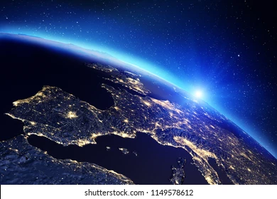

# save-the-earth-
It's a simple project from me for saving the earth

<p></p>

<p></p>

<a href="./Earth.webp">
```
Click here if Image not loading and then click on view raw
```
 </a> 

Or

<a href="https://raw.githubusercontent.com/BlaizingInfernoDragon123/save-the-earth-/main/Earth.webp">Or click here For Online View</a>
